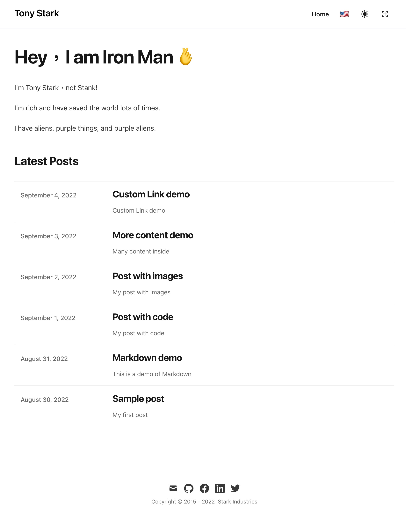
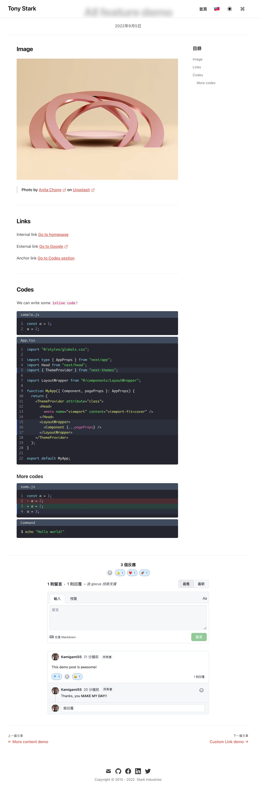
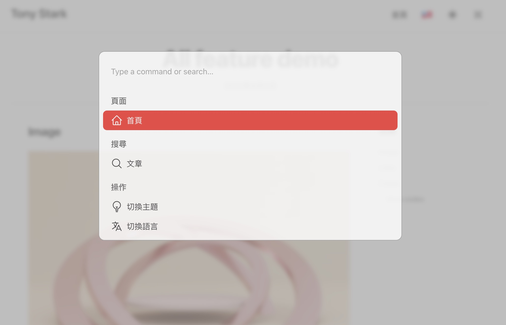
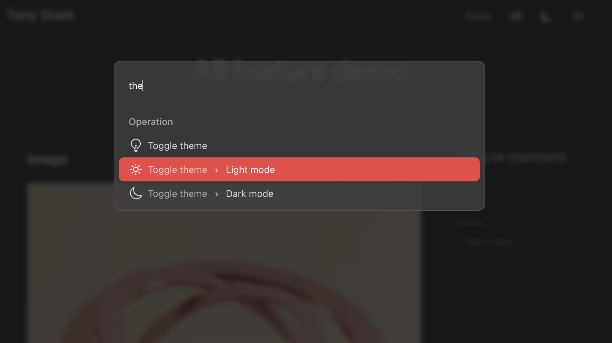

# Next.js Tailwind Contentlayer Blog Starter


Blog starter template with modern frontend tech stack like Next.js, Tailwind CSS, Contentlayer, i18Next

Inspired and modified from [timlrx/tailwind-nextjs-starter-blog](https://github.com/timlrx/tailwind-nextjs-starter-blog)

## Demo

[https://nextjs-tailwind-contentlayer-blog-starter.vercel.app/](https://nextjs-tailwind-contentlayer-blog-starter.vercel.app/)

Or scroll down to see the [screenshots](#screenshots)

## Features

- Writing with local Markdown / MDX files
- Blazing fast performance
- SEO friendly
- Dark Mode
- Command Palette
- Comment system
- Page transition progress bar
- RSS Feed
- Sitemap
- Code syntax highlighting

## Tech stack

- [Next.js](https://nextjs.org/): React meta framework
- [Contentlayer](https://github.com/contentlayerdev/contentlayer): MDX processor
- [Tailwind CSS](https://tailwindcss.com/): CSS framework
- [next-i18next](https://github.com/i18next/next-i18next): localization
- [next-seo](https://github.com/garmeeh/next-seo#news-article): SEO meta tags
- [kbar](https://github.com/timc1/kbar): command palette
- [giscus](https://github.com/giscus/giscus): comment system
- [nprogress](https://github.com/rstacruz/nprogress): page transition progress bar
- TypeScript
- Eslint, Prettier

## Getting Started

Start local server for development:

```bash
pnpm dev
```

## Screenshots

### Home Page




### Post Page




## Command Palette




